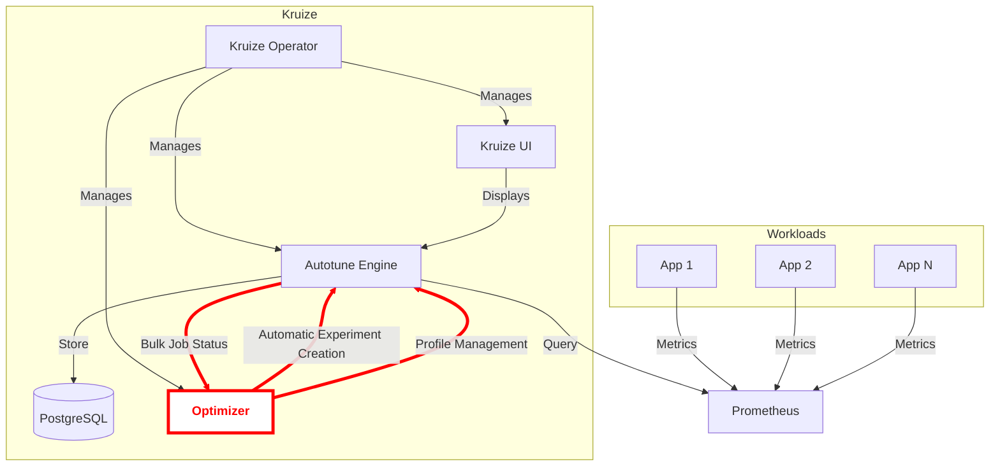

# Design Documentation

This document describes the architecture, design principles, and key components of the Kruize Optimizer.

## Table of Contents

- [Overview](#overview)
- [Architecture](#architecture)
- [Core Components](#core-components)
- [Design Principles](#design-principles)
- [Data Flow](#data-flow)
- [Technology Stack](#technology-stack)
- [Extension Points](#extension-points)

## Overview

Kruize Optimizer is a cloud-native optimization service designed to provide support for Kruize (https://github.com/kruize/autotune) to automatically create experiments and manage Kruize profiles. I

### Key Features

- **Automatic Experiment Creation**: Automatically Kruize create experiments based on user-defined labels
- **Profile Management Support**: Manages and install missing profiles in Kruize
- **Webhook Integration**: Event-driven architecture for real-time updates

## Architecture

### High-Level Architecture



### Component Interaction

- Users will directly interact with Kruize APIs or UI. 
- Optimizer will interact with Kruize to create experiments and manage profiles. 
- The UI will interact with Kruize to display and manage experiments/ recommendations.

## Core Components

### 1. Resource Layer

The resource layer handles HTTP requests and provides RESTful endpoints.

**Key Resources:**
- [`WebhookResource`](../src/main/java/com/kruize/optimizer/resource/WebhookResource.java) - Processes webhook events
> NOTE: Resources apart from WebhookResource will be removed in next release
- [`DatasourceResource`](../src/main/java/com/kruize/optimizer/resource/DatasourceResource.java) - Manages datasource operations
- [`JobsResource`](../src/main/java/com/kruize/optimizer/resource/JobsResource.java) - Handles optimization job operations
- [`MetadataProfileResource`](../src/main/java/com/kruize/optimizer/resource/MetadataProfileResource.java) - Manages metadata profiles
- [`MetricProfileResource`](../src/main/java/com/kruize/optimizer/resource/MetricProfileResource.java) - Manages metric profiles
- [`LayerResource`](../src/main/java/com/kruize/optimizer/resource/LayerResource.java) - Handles layer configurations
- [`StatusResource`](../src/main/java/com/kruize/optimizer/resource/StatusResource.java) - Provides Kruize system status

### 2. Service Layer

The service layer contains business logic and orchestrates operations.

**Key Services:**
- [`DatasourceService`](../src/main/java/com/kruize/optimizer/service/DatasourceService.java) - Datasource management logic
- [`JobsService`](../src/main/java/com/kruize/optimizer/service/JobsService.java) - Job processing and management
- [`BulkSchedulerService`](../src/main/java/com/kruize/optimizer/service/BulkSchedulerService.java) - Bulk operation scheduling
- [`ProfileService`](../src/main/java/com/kruize/optimizer/service/ProfileService.java) - Profile management
- [`KruizeStateService`](../src/main/java/com/kruize/optimizer/service/KruizeStateService.java) - Application state management
- [`StatusService`](../src/main/java/com/kruize/optimizer/service/StatusService.java) - Status information provider

### 3. Model Layer

Domain models representing core entities.

**Key Models:**
- [`Datasource`](../src/main/java/com/kruize/optimizer/model/kruize/Datasource.java) - Datasource configuration
- [`JobsOverview`](../src/main/java/com/kruize/optimizer/model/kruize/JobsOverview.java) - Job information
- [`KruizeProfile`](../src/main/java/com/kruize/optimizer/model/kruize/KruizeProfile.java) - Profile definitions
- [`KruizeStatus`](../src/main/java/com/kruize/optimizer/model/kruize/KruizeStatus.java) - System status
- [`WebhookPayload`](../src/main/java/com/kruize/optimizer/model/WebhookPayload.java) - Webhook data structure

### 4. Client Layer

External system integration.

**Key Clients:**
- [`KruizeClient`](../src/main/java/com/kruize/optimizer/client/KruizeClient.java) - HTTP client for external services

### 5. Configuration System

Profile-based configuration for flexibility and extensibility.

**Configuration Types:**
- **Metadata Profiles**: Define cluster and application metadata
TODO: add metadata profiles file link
- **Metric Profiles**: Specify metrics to collect and analyze
TODO: add metric prifile file link
- **Layer Configurations**: Container, JVM, and framework-specific settings

**Configuration Files:**
- [`container.json`](../src/main/resources/configs/layers/container.json) - Container layer config
- [`hotspot.json`](../src/main/resources/configs/layers/hotspot.json) - Hotspot JVM config
- [`quarkus.json`](../src/main/resources/configs/layers/quarkus.json) - Quarkus framework config
- [`semeru.json`](../src/main/resources/configs/layers/semeru.json) - Semeru JVM config

## Design Principles

### 1. Separation of Concerns

Each layer has a distinct responsibility:
- **Resources**: HTTP handling and validation
- **Services**: Business logic and orchestration
- **Models**: Data representation
- **Clients**: External communication

### 2. Profile-Based Configuration

Flexible configuration through JSON profiles allows:
- Easy customization without code changes
- Version-controlled configurations
- Environment-specific settings
- Extensibility for new metrics and layers

### 3. Stateless Design

The service is designed to be stateless where possible:
- Enables horizontal scaling
- Simplifies deployment
- Improves reliability


## Data Flow

### Optimizer Job Flow

```
1. User installs Kruize and Optimizer
   ↓
2. Optimizer installs missing profiles (periodically)
   ↓
3. User labels their workloads
   ↓
4. Optimizer creates bulk experiments for labelled workloads (periodically)
   ↓
5. Kruize generated recommendations for created experiments
   ↓
6. Recommendations generated
   ↓
7. Results stored in Kruize DB
   ↓
8. Bulk Job Response returned to Optimizer 
   ↓
9. Optimizer receives results and updated summary
   ↓
10. Users view recommendations on Kruize UI
```

### Webhook Event Flow

```
1. External system sends webhook
   ↓
2. WebhookResource receives payload
   ↓
3. Payload validated and parsed
   ↓
4. Event processed by service layer
   ↓
5. State updated if needed
```

### Bulk Operation Flow

```
1. Bulk request triggered (periodically)
   ↓
2. BulkSchedulerService creates operations
   ↓
3. Operations processed by Kruize
   ↓
4. Progress tracked
   ↓
5. Results received via webhook
   ↓
6. Summary updated
```

## Technology Stack

### Core Framework

- **Quarkus**: Cloud-native Java framework
  - Fast startup time
  - Low memory footprint
  - Native compilation support
  - Reactive and imperative programming models

### Build Tools

- **Maven**: Project management and build
- **Docker**: Containerization
- **Kustomize**: Kubernetes configuration management

## Future Enhancements Planned 

- Improve Logging and Tracing
- Add support for custom prometheus metrics
- Add support for multiple custom pre-configured profiles for dev/prod clusters

---

**Last Updated**: 2026-05-05